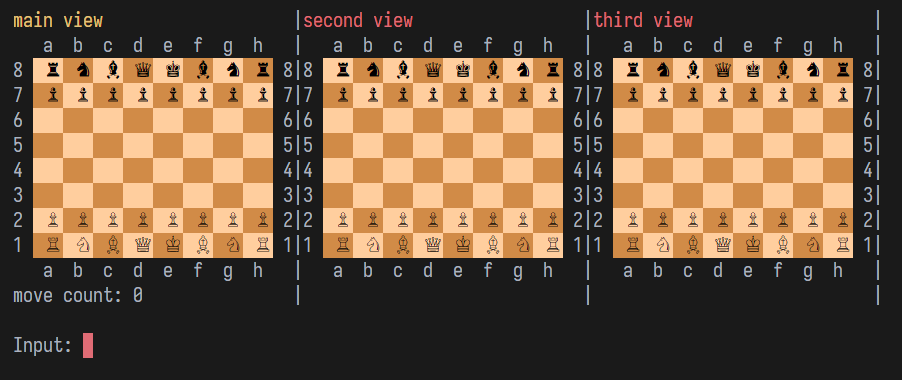
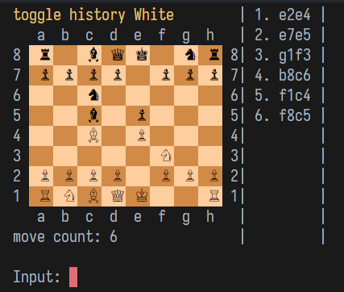
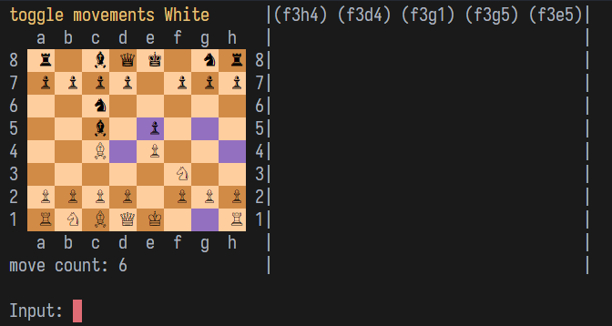
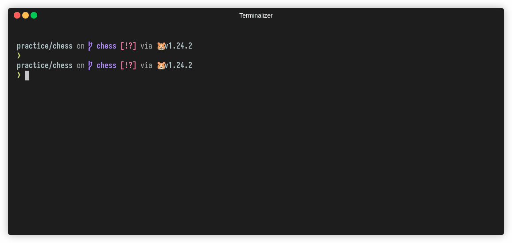

Реализация шахмат

## Ограничения
Доступное подмножество языка: только встроенные возможности и стандартная библиотека

## Фазы работы программы

- Подготовка доски с фигурами
- Ход игрока
- Анализ доски (хода)
- Обновление доски с фигурами
- Обновление игровой информации
- Рендер интерфейса

## Детали реализации

- Пользовательский интерфейс рисуется в терминал
- Для раскрашивания текста и шахматных клеток используются ANSI escape-последовательности (24bit TrueColor)
- Для компоновки интерфейса (лейаута) из нескольких блоков, вводятся абстракции: Box, Layout, Orientation
- Движение пешек реализовано с учетом, того что белые фишки начинаю игру с нижней части доски, а черные с верхней

## Статус реализации функциональности

- (реализовано) перемещение фигур с учетом правил их перемещения
- (реализовано) проверки шаха, мата, пата
- (не реализовано) битое поле
- (не реализовано) превращение пешки
- (не реализовано) рокировка
- (не реализовано) проверки ситуаций приводящих к ничье (троекратное повторение, недостаток материала, правило 50 ходов)

## Демо

### Колоночный лейаут (раскладка)



### История ходов



### Выделение клеток, на которые может сходить фигура



### Демо (Передвижение фигур, выбор фигуры)



### Демо (Шах)


## Запись сессии терминала для README

```sh
# record terminal session
terminalizer record demo

# update demo.yaml
fontFamily: "IosevkaTerm NFM, Arial Unicode MS, Monaco, Lucida Console, Ubuntu Mono, Monospace"
fontSize: 18

# render
terminalizer render demo
```
Установка шрифтов
```sh
# 1. get both fonts from www (IosevkaTerm NFM, Arial Unicode MS)
# 2. move fonts to other fonts, e.g.
mv ./*.ttf ~/.local/share/fonts
# 3. update font cache
fc-cache -vf
```